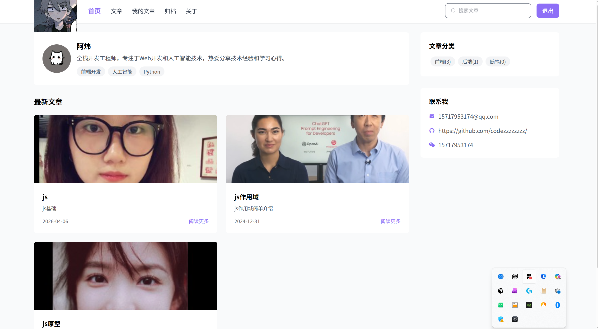
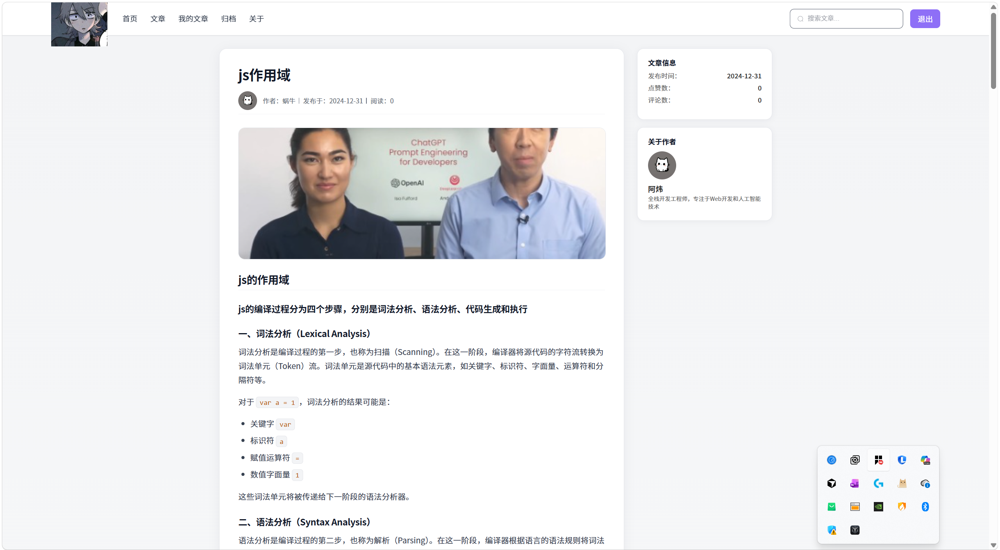
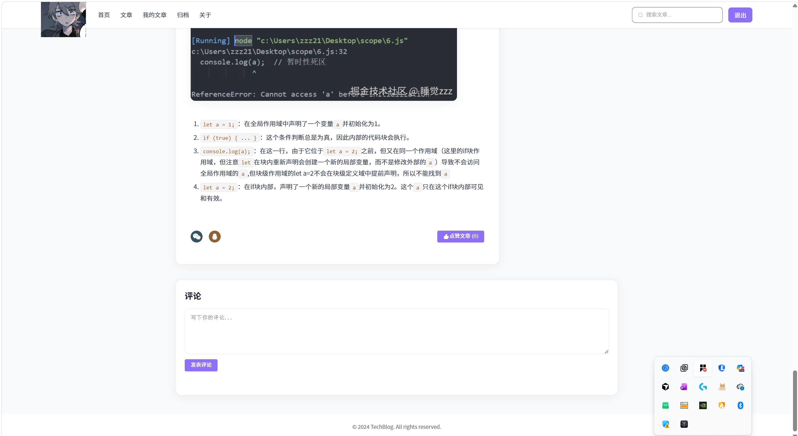
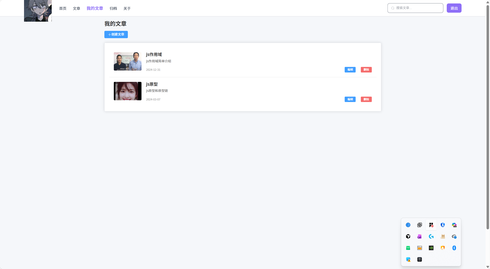
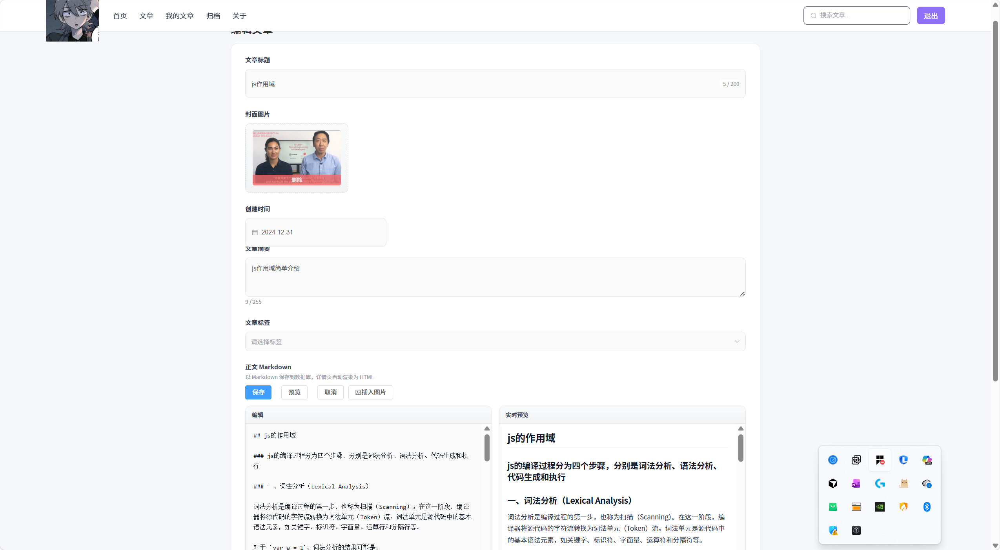
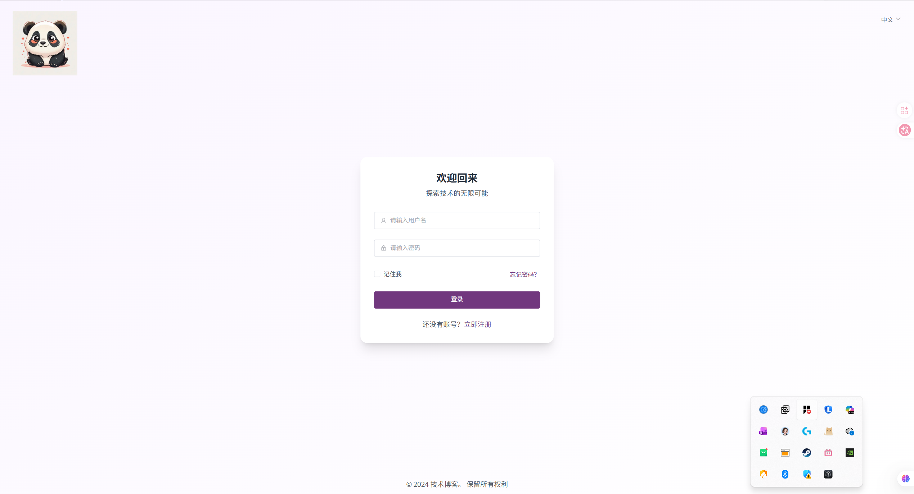
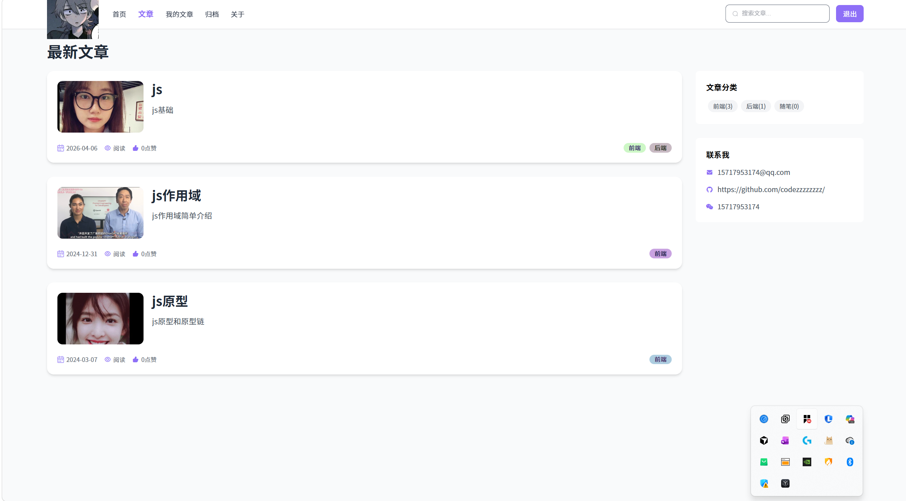
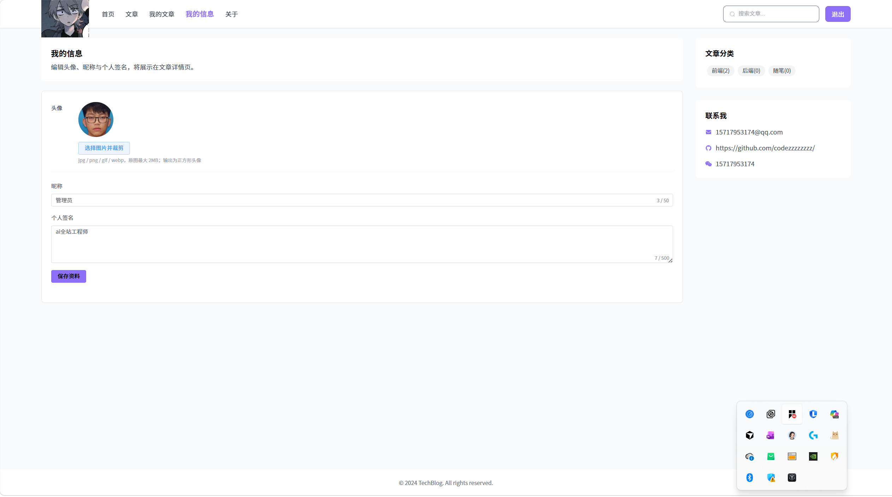

# 个人博客系统

一个基于 Vue3 + Koa2 + MySQL 的全栈个人博客系统

**当前版本：v.3.0**

---

## 📸 项目截图











---

## 🛠 技术栈

### 前端
- **框架**: Vue 3 (Composition API)
- **构建工具**: Vite 6
- **路由**: Vue Router 4
- **UI 组件库**: Element Plus
- **HTTP 客户端**: Axios
- **样式预处理**: Less
- **自动导入**: unplugin-auto-import + unplugin-vue-components
- **Markdown**: marked + DOMPurify（编辑与详情页安全渲染）
- **图片裁剪**: Cropper.js 2.x（封面、正文插图与头像）

### 后端
- **运行环境**: Node.js
- **Web 框架**: Koa 2
- **路由**: koa-router
- **数据库**: MySQL 8+
- **数据库驱动**: mysql2 (Promise API)
- **身份认证**: JWT (jsonwebtoken)
- **文件上传**: multer、koa-static
- **XSS 防护**: DOMPurify + JSDOM
- **跨域处理**: @koa/cors
- **请求体解析**: @koa/bodyparser（含 DELETE 等方法的 JSON 体）
- **环境变量**: dotenv

### 部署
- **反向代理**: Nginx
- **进程管理**: PM2 (推荐)

---

## ✨ 核心功能

### 文章管理
- 📝 文章列表展示（分页）
- 📖 文章详情阅读（Markdown 渲染）
- ✏️ Markdown 分栏编辑、实时预览
- 🖼️ 封面与正文图片上传与裁剪
- 🏷️ 文章分类与标签管理
- 👤 我的信息（头像本地上传、昵称、个人签名）
- 🔥 最新文章推荐
- 📂 我的文章（创建、编辑、删除）

### 用户系统
- 👤 用户注册 / 登录
- 🔐 JWT Token 身份认证（请求头 `Authorization` 携带令牌）
- 🔒 MD5 密码加密
- 🎨 文章详情展示作者头像与签名

### 互动功能
- ❤️ 文章点赞
- 💬 评论系统
- 👥 用户关联评论

### 安全特性
- 🛡️ XSS 攻击防护（DOMPurify）
- 🔐 关键写操作使用参数化查询；部分读操作仍需注意 SQL 拼接风险
- 🔑 JWT 无状态认证

---

## 🚀 快速开始

### 环境要求
- Node.js 18+
- MySQL 8+
- npm / yarn / pnpm

### 1. 克隆项目

```bash
git clone https://github.com/你的用户名/blog.git
cd blog-master
```

### 2. 数据库配置

1. 创建数据库并导入初始化脚本

```bash
mysql -u root -p < blog-server/init-db.sql
```

或使用 Navicat / DBeaver 等工具执行 `blog-server/init-db.sql` 文件。

2. **若数据库是旧版本（无 `users.bio` 字段）**，请先执行升级脚本：

```bash
mysql -u root -p blog < blog-server/migrations/001-add-user-bio.sql
```

全新安装仅执行 `init-db.sql` 即可，无需再跑上述迁移。

3. 配置后端环境变量

在 `blog-server` 目录下创建 `.env` 文件：

```env
MYSQL_HOST=localhost
MYSQL_PORT=3306
MYSQL_USERNAME=root
MYSQL_PASSWORD=你的MySQL密码
MYSQL_DATABASE=blog
PORT=3000

# 公网访问根地址（无尾斜杠），上传图片返回的 URL 会用它；部署到远程务必填写
# 示例：https://blog.example.com
PUBLIC_ORIGIN=

# 置于 Nginx 反代后建议：TRUST_PROXY=1（与 index.js 中 app.proxy 配合，识别 HTTPS）
TRUST_PROXY=1
```

### 4. 启动后端服务

```bash
cd blog-server
npm install
npm run dev
```

后端服务将在 `http://localhost:3000` 启动。

### 5. 启动前端服务

```bash
cd blog-client
npm install
npm run dev
```

前端开发服务默认 `http://localhost:8083`（见 `blog-client/vite.config.js`，端口可改）。  
生产构建后 Axios `baseURL` 为 `/api`，需由 Nginx 反向代理到后端。

### 6. 测试账号

- 用户名: `admin`
- 密码: `123456`

（以 `init-db.sql` 中数据为准，上线前请修改默认密码。）

---

## 📁 项目结构

```
blog-master/
├── blog-client/              # 前端项目
│   ├── src/
│   │   ├── api/             # API 接口封装
│   │   ├── assets/          # 静态资源
│   │   ├── components/      # 公共组件
│   │   ├── router/          # 路由配置
│   │   ├── styles/          # 全局样式（如 Markdown 正文）
│   │   ├── utils/           # 工具函数（如 Markdown 渲染）
│   │   ├── views/           # 页面组件
│   │   ├── App.vue
│   │   └── main.js
│   ├── public/              # 公共静态资源（如默认头像 image.png）
│   ├── index.html
│   ├── package.json
│   └── vite.config.js
│
├── blog-server/              # 后端项目
│   ├── config/              # 数据库配置
│   ├── controllers/         # 业务逻辑层（index.js）
│   ├── migrations/          # 已有库增量 SQL（如用户表 bio）
│   ├── router/              # 路由定义
│   ├── utils/               # 工具函数（JWT、XSS 等）
│   ├── uploads/             # 用户上传文件
│   ├── index.js             # 入口文件
│   ├── init-db.sql          # 数据库初始化脚本
│   ├── package.json
│   └── .env                 # 环境变量（需自行创建）
│
└── readme.md
```

---

## 🔧 数据库设计

| 表名 | 说明 |
|------|------|
| users | 用户表（含昵称、头像、个人签名 `bio` 等） |
| article | 文章表 |
| tags | 标签表 |
| article_tags | 文章-标签关联表 |
| comment | 评论表 |
| article_user | 用户点赞文章表 |

---

## 📦 部署上线

1. 前端：`cd blog-client && npm run build`，将 `dist/` 部署到静态资源目录。  
2. 后端：`cd blog-server`，使用 PM2 等方式常驻 `node index.js`。  
3. Nginx：将前端静态站点与 `/api` 反向代理到 Node 服务（与开发环境 `baseURL` 约定一致）。  
4. 生产环境请修改 JWT 密钥、数据库密码等敏感配置，勿提交 `.env`。

### 图片上传后无法显示（远程部署常见问题）

- **原因一：接口写死的本地地址**  
  旧版封面/正文上传曾返回 `http://localhost:3000/...`，写入数据库后浏览器仍会请求你本机。现已在服务端用 `PUBLIC_ORIGIN` 与请求头动态拼接；**请在服务器 `.env` 中设置 `PUBLIC_ORIGIN=https://你的域名`**（与浏览器访问站点一致，不要尾斜杠）。

- **原因二：Nginx 只转发了 `/api`，图片路径没有到 Node**  
  上传文件由 Koa 挂在站点根路径同级资源（如 `/cover-xxx.jpg`、`/avatars/xxx.jpg`）。若 Nginx 只配置了 `location /api/`，这些 URL 不会进 Node，会 404。请在 Nginx 中增加对上传目录的转发（路径按你实际 `uploads` 生成规则调整），例如：

```nginx
# API
location /api/ {
    proxy_pass http://127.0.0.1:3000/;
    proxy_set_header Host $host;
    proxy_set_header X-Real-IP $remote_addr;
    proxy_set_header X-Forwarded-For $proxy_add_x_forwarded_for;
    proxy_set_header X-Forwarded-Proto $scheme;
}

# 头像目录
location /avatars/ {
    proxy_pass http://127.0.0.1:3000/avatars/;
    proxy_set_header Host $host;
}

# 封面 / 编辑器图片（multer 默认文件名多为 cover-、image- 前缀）
location ~* ^/(cover-|image-)[^/]+\.(jpe?g|png|gif|webp)$ {
    proxy_pass http://127.0.0.1:3000;
    proxy_set_header Host $host;
}
```

- **原因三：反代未传 HTTPS**  
  若未设置 `X-Forwarded-Proto`，Node 可能生成 `http://` 链接。请配置上述头并设置 `TRUST_PROXY=1`，或直接依赖 **`PUBLIC_ORIGIN` 为 https**。

前端会对「仍指向 localhost 的旧数据」在生产环境自动换成当前页面域名（`mediaUrl.js`），但**根本仍依赖 Nginx 能把对应路径转到 Node**。

如需单独文档，可在仓库根目录自行补充 `deploy.md`（例如 PM2、HTTPS 等细则）。

---

## 💡 技术亮点

1. **数据库连接池**：使用 mysql2 连接池优化数据库性能
2. **XSS 防护**：DOMPurify + JSDOM 过滤用户输入；前端详情页对 HTML 输出做净化
3. **JWT 认证**：无状态身份认证机制
4. **参数化查询**：创建/更新文章等写操作使用参数化，降低 SQL 注入风险
5. **前后端分离**：清晰的架构设计
6. **RESTful API**：规范的接口设计
7. **Markdown 工作流**：存储 Markdown，阅读端统一渲染与安全过滤

---

## 📝 开发日志

- 使用 Vue 3 Composition API 组织代码
- 实现响应式布局，适配不同屏幕尺寸
- 封装统一的 Axios 请求拦截器
- 使用 Element Plus 快速构建 UI
- 数据库连接池管理，提升性能
- 完善的错误处理机制
- 文章编辑采用 Markdown + 图片裁剪上传；详情页 marked + DOMPurify 渲染

**版本记录**

- **v.1.0** 基础博客功能（文章列表、详情、登录注册、评论与点赞等）。
- **v.2.0** 新增文章编辑能力：Markdown 分栏编辑与预览、封面与正文插图上传及 Cropper 裁剪。
- **v.3.0** 以「我的信息」替代原「归档」页：支持昵称、个人签名（`users.bio`）、头像本地上传与 1:1 裁剪；文章详情与评论等场景展示作者/用户头像与签名；无头像时使用 `blog-client/public/image.png` 作为默认图；归档相关接口与页面已移除。旧库请执行 `blog-server/migrations/001-add-user-bio.sql` 增加 `bio` 字段。

---

## 📄 License

ISC

---

## 👤 作者

邹嘉炜

---

## 🤝 贡献

欢迎提交 Issue 和 Pull Request！

---

*如果这个项目对你有帮助，欢迎给个 Star ⭐*
